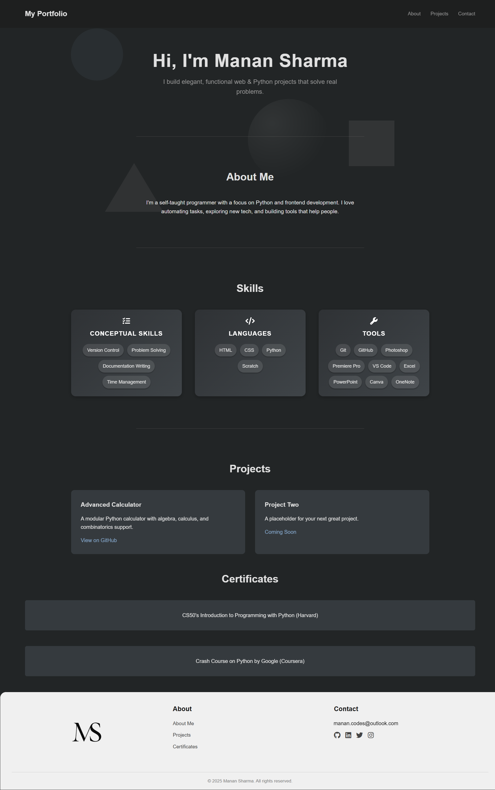

```
    __  ___                      
   /  |/  /___ _____  ____ _____ 
  / /|_/ / __ `/ __ \/ __ `/ __ \
 / /  / / /_/ / / / / /_/ / / / /
/_/  /_/\__,_/_/ /_/\__,_/_/ /_/ 
                                
```

# 🌐 My Portfolio

Welcome to my personal portfolio website!  
A place where I share my projects, skills, and a little bit about myself — all wrapped in a clean, responsive design.

## 🔗 Live Demo
**Visit here:** [https://maybemanan.github.io/portfolio/](https://maybemanan.github.io/portfolio/)

---

## 📂 Project Structure

```
portfolio/
├── index.html      # Main HTML file
├── style.css       # Stylesheet
├── script.js       # JavaScript animations & interactions
├── favicon.png     # Browser tab icon
├── logo.png        # Footer branding image
```

---

## ✨ Features

- **Responsive Design** — Looks great on mobile, tablet, and desktop.
- **Smooth Animations** — Subtle transitions for a modern feel.
- **Social Links** — Quick access to my GitHub, LinkedIn, Instagram and email.
- **Simple & Clean UI** — Minimalist layout for easy navigation.

---

## 🛠️ Tech Stack

- **HTML5** — Markup and structure
- **CSS3** — Styling and responsiveness
- **JavaScript (Vanilla)** — Interactivity & animations

---

## 🚀 Getting Started

To run this project locally:

1. **Clone the repository**
   ```bash
   git clone https://github.com/MaybeManan/portfolio.git
   ```

2. **Open `index.html` in your browser**
   - You can simply double-click it, or
   - Use a local server (recommended for JS features):
     ```bash
     # Python 3
     python -m http.server
     ```
     Then visit: `http://localhost:8000`

---

## 📷 Screenshots



---

## 👨‍💻 Author

**Manan Sharma**  
Aspiring computer scientist. Passionate about absurdism, logic, and building things that (sort of) make sense.

> “Embracing the absurdity of life 🌌✨”

---

## 📬 Contact

- **Email:** [manan.codes@outlook.com](mailto:manan.codes@outlook.com)
- **GitHub:** [@MaybeManan](https://github.com/MaybeManan)
- **LinkedIn:** [Manan Sharma](https://www.linkedin.com/in/manan-sharma-page/)

---

## 📜 License

This project is licensed under the **MIT License** — see the [LICENSE](LICENSE) file for details.